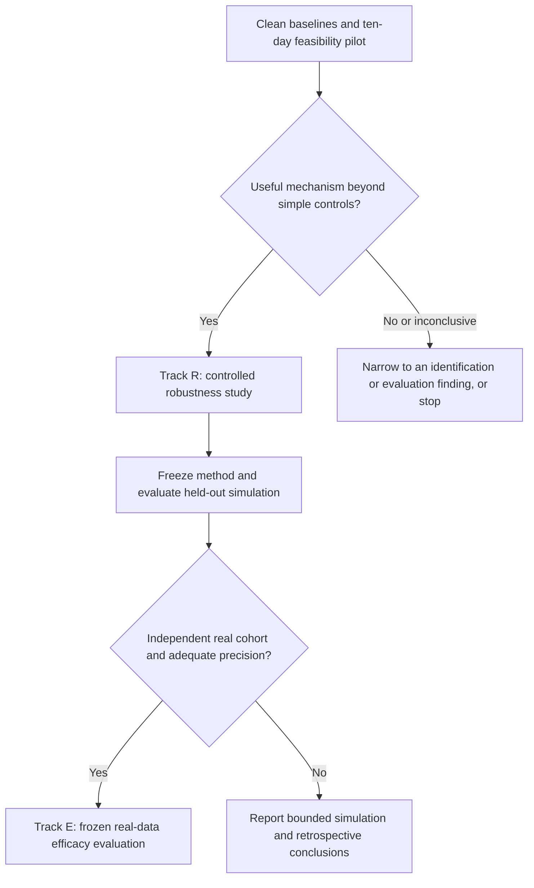

# Research direction and paper roadmap

**V01 follow-up, 9 October 2026.** The [closest-work compatibility review](../execution/closest_work_comparison.md) is complete. Final Sanchez/AMOS papers and sequence code are now accessible; OCI v2 adds recent prior art. Earlier access-limit statements below are dated history. Numerical reproductions and V02 design repairs remain pending.

**Execution update, 9 October 2026 - NARROW.** The first research cycle supports continuing Track R as a controlled robustness/measurement benchmark; the candidate grouping method has not established superiority. It reduces overlap degradation relative to simple pooling in one synthetic regime, but latest-only has lower absolute heavy-overlap loss, shared bias changes the comparison, and several controls collapse in the initial generator. Real-data grouping also trails simpler predictors. V01 is the next ready task, followed by V02 design repair/comparators and V03 protocol freeze. Do not force a positive method paper. The [feasibility decision](../execution/feasibility_decision.md) records the falsifiable next claim and failed alternatives; a [manuscript skeleton](../../../paper/manuscript.md) now has explicit result placeholders. The [live checklist](../../../RESEARCH_CHECKLIST.md) is the authoritative continuation record. This update supersedes the original ten-day schedule where those tasks are now complete.

**ConjunctionTriage — report 3 of 3 — 6 October 2026**

**Deep-research revision, 6 October 2026.** This edition incorporates a second, targeted review of recent forecasting papers, dependence/fusion foundations, risk-control assumptions, and actual data access. It changes the immediate deliverable from a presumed efficacy study to a staged information-reuse robustness study. Independent real-data efficacy remains conditional on access and statistical precision. Recent publication dates are checked against the publisher or preprint record, rather than search-engine crawl dates.

**Purpose:** decide which paper to pursue, what would make its contribution credible, and how to turn the existing project into a submission. This is a research strategy, not a completed manuscript or a claim that new experiments have succeeded.

Read this together with [Report 1: evidence audit](01_EVIDENCE_AUDIT_AND_CURRENT_RESULTS.md) and [Report 2: experiment and analysis plan](02_PUBLICATION_EXPERIMENTS_AND_ANALYSIS_PLAN.md). Report 1 governs statements about existing results. Report 2 governs proposed measurements. This report governs scope, priorities, and publication decisions. The September [novelty assessment](../2026-09-06/_work/report-source.md) remains useful background; its proposals are reassessed here against the current repository and more recent literature.

## 1. Recommended direction

Move the project toward **information-reuse robustness in conjunction-risk forecasting**, with dependence-aware triage as the method hypothesis rather than an assumed successful solution. First measure whether retransmission, overlapping tracking updates, or uncertain update provenance materially change forecast calibration and review decisions beyond what simple controls already handle. Only then test whether a specific dependence treatment improves the tradeoff between review workload and missed elevated-final-risk events.

The feasible default paper package is a reproducible retrospective benchmark plus controlled observation-lineage experiments. A second, stronger package adds a sequestered independent real cohort and a prespecified efficacy test. The former can establish a bounded mechanism or method result; it cannot be presented as the latter. This distinction is necessary because the current eligible training population contains only 66 high-risk events and no new independent real evaluation cohort has been secured.

The intended output is a calibrated forecast of the **recorded final-CDM risk class**, accompanied by a review decision and an account of the evidence available at prediction time. It is not a prediction that an actual collision will occur, an autonomous maneuver recommendation, or a validation of physical collision probability against reality.

The central contribution must be a specific method and a convincing measurement. Merely adding uncertainty estimates, a Transformer, an LLM, a dashboard, or a space-weather index is insufficient. The literature already contains sequence models, uncertainty-aware conjunction classification, and LLM interfaces to orbital tools. Our assessment is that a narrowly defined treatment of uncertain observation reuse is a plausible research opening; novelty is conditional on comparison with the closest work below.

Use the current negative LLM result and the audit as the foundation. If the new method does not clear the feasibility gate, pursue a narrower **reproducibility and intervention-evaluation paper** only if matched-cohort analysis and corrected controls establish a useful lesson beyond one model losing on one benchmark. A careful negative result can be valuable, but neither negative results nor clean software automatically guarantee publication.

No venue or deadline was supplied. The planning assumption is one primary researcher with periodic astrodynamics and statistical supervision, targeting a space or aerospace journal. A bounded retrospective/mechanism package may fit approximately 10–14 focused weeks if a suitable simulator and comparators are available. Building and independently validating observation-to-orbit-determination simulation from scratch could extend that to 16–24 weeks. These are planning estimates, not delivery promises, and exclude data-access delays and journal review.

## 2. What the project already contributes

The repository provides a useful experimental platform: public-data ingestion, a reproduced benchmark metric, a latest-CDM baseline, stored LLM responses, an audited correction to future-dependent feature extraction, numerical orbital checks, and a substantial offline test suite. These lower the cost of doing rigorous research. They should support the paper without becoming its main novelty claim.

The strongest surviving historical result is specific: on the stored 2,167-event evaluation, the v1 corrector has L = 1.6606049431 against B1 = 0.6939612612. Report 1 freshly recomputes these values from saved predictions. This demonstrates failure of that configuration on that cohort under that metric. It does not show that language models cannot help space operations, that all learned predictors fail, or that the latest risk is an unbeatable predictor.

Several facts change the development plan:

| Finding | Consequence for the paper |
|---|---|
| Two frozen learned features depend on future message count/time | Historical B4/B5 and affected hybrid/ablation results cannot support clean method comparisons. |
| The corrected-results artifact is a two-split pilot | Complete, versioned corrected evaluation is still required. The existence of a JSON file does not close this task. |
| Original self-consistency arms have different complete-case cohorts and differently defined verdict fields | Report matched event IDs and common action definitions; retain original numbers only as historical measurements. |
| The public test labels have informed later analysis | Use that data openly for development and historical reconstruction; do not relabel a reshuffle as an untouched test. |
| Public tracking metadata does not identify underlying observations exactly | A physical claim about shared measurements needs controlled lineage or better data; public-data proxies must retain an unknown state. |

These are research design constraints. They do not require discarding the system or rewriting frozen history. Preserve the old result, document its limits, and create new experiment namespaces.

## 3. Closest literature and the resulting novelty boundary

The review prioritised original papers, institutional manuscripts, official dataset records, and journal scope pages. It is a bounded literature assessment as of 6 October 2026, not proof that an idea is globally unclaimed. Full-paper access was uneven; abstract-only entries are identified.

| Work and verified source | What is already established | Required distinction for this project |
|---|---|---|
| Uriot et al., *Spacecraft Collision Avoidance Challenge: design and results of a machine learning competition*, 2020 preprint, later Astrodynamics article ([paper](https://arxiv.org/abs/2008.03069)) | Final-risk forecasting, the Kelvins task, and strong persistence baselines already exist. | Reproduce the protocol; contribute something beyond restating the task or beating a weak comparator. |
| Sánchez, Rodríguez-Fernández and Vasile, *Robust classification with belief functions and deep learning applied to STM*, IEEE CEC 2024 ([accepted manuscript](https://strathprints.strath.ac.uk/90331/)) | Robust CDM-sequence classification combines epistemic uncertainty with several learned models. | Compare against sequence-aware and uncertainty-aware methods, not just latest risk. |
| Sánchez et al., *Treatment of epistemic uncertainty in conjunction analysis with Dempster-Shafer theory*, ASR 2024 ([institutional record](https://strathprints.strath.ac.uk/90580/)) | Evidence-based conjunction uncertainty treatment is established. | Specify the extra treatment of dependence and uncertain update provenance. |
| Sánchez Fernández-Mellado, *Robust artificial intelligence for space traffic management*, PhD 2025 ([thesis](https://stax.strath.ac.uk/concern/theses/w9505114f)) | CASSANDRA addresses robust decision support; its discussion identifies CDM dependence and reused information as unresolved concerns. | Address that documented limitation with a measurable method; do not claim to discover dependence itself. |
| Zerrouki et al., *Deep learning for full-horizon uncertainty-aware prediction of CDM sequences in spacecraft collision avoidance*, online August 2026 ([publisher](https://doi.org/10.1016/j.actaastro.2026.08.013)) | Publisher-indexed abstract describes time-aware sequence prediction, quantile heads and split conformal uncertainty. Full paper was not retrieved in this review. | Obtain and inspect its evaluation before finalising the comparator. Generic sequence prediction plus calibrated intervals is already occupied. |
| Mashiku, Newman and Highsmith, *NASA CARA Compendium for Artificial Intelligence and Machine Learning for Satellite Collision Avoidance*, AMOS 2025 ([NASA record](https://ntrs.nasa.gov/citations/20250008251)) | Broad investigations of early conjunction information and AI/ML limitations predate this project. | A negative-result paper needs a sharper mechanism and reproducible controls. |
| Olson et al., *Contextual Predictive Model for Early Identification of High-Covariance Conjunctions*, 2026 ([article](https://doi.org/10.1007/s40295-025-00549-9)) | Early identification of cases needing attention has close operational research precedents. | Separate final-risk forecasting from tracking-priority prediction and compare targets precisely. |
| Caldas et al., *Conjunction Data Messages behave as a Poisson Process*, 2021 ([paper](https://arxiv.org/abs/2105.08509)); Guimarães et al., Bayesian non-homogeneous CDM process, 2023 ([paper](https://arxiv.org/abs/2311.05426)) | Message-arrival modelling already exists. | Predicting another message is distinct from identifying new information. Do not rename an arrival model as information freshness. |
| Acciarini et al., *Kessler: a Machine Learning Library for Spacecraft Collision Avoidance*, 2021 ([ESA proceedings](https://conference.sdo.esoc.esa.int/proceedings/sdc8/paper/226)) | A probabilistic CDM simulation/library starting point exists. | A controlled lineage experiment requires an explicit observation-reuse construction and independent checks; borrowing a simulator is not novelty. |
| Harsha M., Buduru and Biswas, *Enhancing space situational awareness tool’s human machine interface functionality using the Large Language Model-powered query system*, online 2026 ([publisher](https://doi.org/10.1016/j.actaastro.2026.07.003)) | An LLM-orchestrated SSA interface with tool execution is already published online. Its December issue date is later than this report. | Treat the local API, MCP and frontend as infrastructure unless a distinct evaluated human-factors question is pursued. |

The practical novelty statement is therefore provisional: **a method or benchmark that represents uncertainty about shared tracking information and establishes when information reuse changes forecast reliability beyond simple controls**. Track R can support that bounded claim through known-lineage experiments and transparent retrospective CDM analysis. Improvement in a defined decision endpoint on independent real CDM events is the stronger Track E ambition. The unit of progress is evidence for the chosen claim, not the number of features, prompts, or screens implemented.

### 3.1 Findings added by the deeper review

The earlier report underweighted both the newest forecasting models and the established mathematics of dependent information. The following additions materially change the comparison set.

| Additional primary work | Verified status and contribution | Consequence for this project |
|---|---|---|
| Ouari, Zerrouki, Bouziane and Gacem, *Probabilistic satellite collision risk prediction via Monte Carlo ensembles*, Applied Intelligence, DOI 10.1007/s10489-026-07494-6 | Publisher records **23 September 2026**. Abstract reports a calibrated stacked ensemble and sequence comparisons on the 199,082-CDM, 15,321-event ESA release. Subscription preview inspected; full evaluation protocol not available in this review. | Add a strong ensemble family and inspect the full paper before claiming superiority to current work. The release is the existing event universe, not a new external cohort. [Publisher](https://link.springer.com/article/10.1007/s10489-026-07494-6) |
| Tüylek Tok et al., *Early Prediction of Satellite Collision Probability Using a Hybrid TCN-Transformer Model for a CDM-Based Conjunction Analysis Framework*, arXiv:2609.13191 | A 2026 preprint/conference manuscript predicting risk in the **next CDM**, using TÜBİTAK UZAY messages and physically motivated features. The arXiv record’s displayed August submission date and September identifier differ; exact first-public chronology should be reconciled before citing it. | A hybrid temporal architecture and physics-derived features are not sufficient novelty. Next-update forecasting is a different target from final risk at a fixed two-day cutoff. [Primary record](https://arxiv.org/abs/2609.13191) |
| Denœux, *Conjunctive and disjunctive combination of belief functions induced by nondistinct bodies of evidence*, Artificial Intelligence, 2008 | Full author manuscript inspected. Cautious combination is designed for overlapping evidence and has idempotence. | Duplicate-insensitive evidence combination is established. Include cautious fusion when a belief-function implementation is compared; a renamed weighting rule is insufficient novelty. [Author manuscript](https://www.hds.utc.fr/~tdenoeux/dokuwiki/_media/en/revues/aij3553_final.pdf) |
| Denœux, *Combination of dependent and partially reliable Gaussian random fuzzy numbers*, Information Sciences, 2024, DOI 10.1016/j.ins.2024.121208 | Full author manuscript inspected, including dependence and unknown-correlation discussion in §3 and combination experiments in §5. | Dependence-sensitive continuous evidence fusion also exists. A contribution must concern identifiable CDM information, a justified construction, or new measured consequences. [Author manuscript](https://www.hds.utc.fr/~tdenoeux/dokuwiki/_media/en/publi/comb_grfn_v2.pdf) |
| Agrawal and Ansari, *Probabilistic Multi-Agent Data Fusion for Reliable Conjunction Assessment and Enhanced Decision-Making*, AMOS 2025 | Official proceedings entry and indexed primary-PDF excerpts verified; full PDF retrieval failed. The method excerpt uses Gaussian precision fusion with a conditional-independence assumption. | Multi-source conjunction fusion is close prior art. Its discussion of unknown correlation does not by itself establish a solution; inspect the full method before making either an equivalence or superiority claim. [Proceedings paper](https://amostech.com/TechnicalPapers/2025/Poster/Agrawal.pdf) |
| ESA Clean Space Days 2026, *Pilot use and expansion of decision support and coordination systems* | Official conference abstract describes AutoCA/AutoSTM, including CDM evolution prediction, fusion and uncertainty-related functions. It is an abstract, not an independently reproduced performance study. | Integrated decision support and generic fusion are active engineering areas. Treat this as context and a possible comparison/access lead, not numerical evidence. [ESA abstract](https://indico.esa.int/event/644/contributions/12217/) |

The abstract of Ouari et al. reports F2 = 0.808 and AUC-ROC = 0.981. These are **author-reported numbers, not an apples-to-apples comparison** with the local B1 F2 of 0.7391. Cohort, prediction time, target, clipping, sampling unit, threshold selection and split construction must match before the values share a ranking table. Keep their reported scores in the related-work extraction sheet until that compatibility is established.

### 3.2 Four distinct tasks that must not share a misleading leaderboard

| Task | Label or object of inference | Appropriate comparator and evaluation |
|---|---|---|
| Historical Kelvins forecasting | Final recorded log-risk from the visible prefix before the two-day cutoff | Same eligible cohort and official clipped L, with F2 and MSE_HR components |
| Proposed triage classification | Whether final recorded risk exceeds the specified threshold | Calibrated final-class probabilities, review counts and paired high-risk misses |
| Robust epistemic classification | A Dempster–Shafer-derived class based on risk and uncertainty criteria | Reproduce that class definition, or explicitly adapt the method to the proposed label |
| Next-CDM or full-trajectory forecasting | Risk/attributes of a later message or a whole time-indexed sequence | Common forecast horizons, event-level splits, sequence error and correctly scoped coverage |

For example, the full CEC 2024 manuscript uses a six-category evidence-derived classification and a 10⁻⁴ risk threshold. Its models are not immediately the same binary final-risk classifiers used here. Its event-grouped split is already a good practice to reproduce, not a new contribution of this project. Report 2 records the implementation consequences. [CEC accepted manuscript](https://strathprints.strath.ac.uk/90331/7/Sanchez-etal-IEEE-CEC-2024-Robust-classification-with-belief-functions-and-deep-learning.pdf)

The paper should maintain a compatibility table for every comparison: dataset version; event count; high-risk count; horizon; visible fields; label; risk floor; split unit; tuning/calibration partitions; metric; failure handling; and code availability. Mark each row as reproduced, adapted, approximation, or discussion-only. Unavailable author code is a limitation to document, not permission to substitute an intentionally weak model and keep the original method name.

### 3.3 A tighter novelty test

There are three possible contributions, and the final paper should earn at least one:

1. **A domain-specific method:** an explicit treatment of partially observed tracking reuse that improves an endpoint beyond calibrated latest risk, simple history features, deduplication, thinning and applicable robust-fusion/sequence alternatives.
2. **A reusable measurement result:** a validated stress benchmark showing which methods fail under which information-reuse conditions, with meaningful real-CDM consequences and accessible artifacts. A benchmark needs independently checked construction and discriminating controls; artificial duplication alone is too easy.
3. **An identification result with practical consequences:** a demonstration that available public fields cannot distinguish specified update histories, together with quantified sensitivity of decisions to that ambiguity and a minimal additional metadata requirement that resolves it.

These are candidate contributions. Basic duplicate invariance, conservative bounds, latent grouping and unknown-correlation fusion are not new in themselves. A familiar method applied competently can still support a useful domain paper if the empirical insight is substantial, but it should be described as such. Avoid promising a new theory when the proposed work is primarily an evaluation and application.

### 3.4 The failure mechanism must be demonstrated, not presumed

A Transformer or GBM trained on one row per event does not necessarily assume the messages inside that row are independent. More messages can carry useful timing and context. Conversely, a procedure that explicitly shrinks a statistical band using the number of CDMs can make an independence assumption that needs scrutiny. Identify the actual algorithmic mechanism before explaining a failure as double counting.

Construct two controls before making that claim: exact retransmission without new information, and genuinely new independent measurements that happen to produce similar risk values. An indiscriminate duplicate filter may harm the second. A model that always ignores the history can pass the first but fail to exploit new evidence. Evaluate both, using observation IDs only in the known-lineage simulator or legitimately supplied external metadata.

Keep physical state fusion separate from forecasting. Consecutive CDMs may use revised dynamics, different predicted TCA or different observations; scalar Pc values are not interchangeable independent measurements of one fixed physical variable. A state-level fusion baseline needs common epochs/frames and defensible covariance semantics. The proposed public-data classifier instead predicts a future recorded class and must be calibrated for that target.

Dependence within an input sequence also does not automatically invalidate event-level conformal prediction. The exchangeability question concerns the calibration and future **event-level examples** to which the guarantee applies. Reused objects, changed selection/prevalence or temporal drift may threaten that condition. Report 2 now separates that issue from message dependence and distinguishes marginal coverage, expected risk control and high-probability risk bounds.

## 4. Candidate method: the smallest useful scientific addition

Let X_i(t) contain only the messages available before a fixed prediction cutoff for event i. Let Y_i denote whether the recorded final log-risk is at least −6. Estimate q_i = P(Y_i = 1 | X_i(t)), and choose whether to review the event using a threshold selected on development data. The forecast q_i is a probability about a future recorded label. It is not the CDM’s physical Pc.

Construct a transparent representation of the sequence that distinguishes:

1. Exact replay of the same message or equivalent source record.
2. A message with changed orbit-determination metadata or geometry but uncertain observation overlap.
3. A genuinely new observation contribution, available only where lineage is known.
4. Unresolved provenance, retained explicitly rather than assigned an invented timestamp or independence label.

The initial implementation should be simple. Canonicalise exact duplicates; derive visible-prefix changes in risk, covariance and OD metadata; retain available observation-age intervals; and compare group-normalised summaries with ordinary temporal aggregation. Report 2 fixes the first prototype more precisely: at most eight label-free candidate partitions, one shared regularised logistic model, and training-only calibration of the maximum partition score. The displayed range is a sensitivity analysis, not a confidence interval. Sequence models belong in the comparator set; add method complexity only after simple controls expose a gap.

Three candidate properties make this testable:

| Property | Test | Limit of the claim |
|---|---|---|
| Replay invariance | Replicating an identical message without new information leaves the forecast unchanged within declared numerical tolerance. | Useful software/method property, but exact duplicate removal may already satisfy it. |
| Controlled response to partial overlap | Confidence and review decisions are evaluated as known measurement overlap increases in simulation. | Interpretation is conditional on the simulator and observation model. |
| Useful response to genuine new evidence | Additional independent measurements in the controlled experiment can alter the forecast and improve predictive performance. | A method that ignores every update could pass invariance while being useless; real-data lineage requires separate evidence. |

Do not assume that more messages provide more independent evidence. Equally, do not assume every changed covariance or OD counter signals a new measurement. Report 1's new raw-data audit reproduces the September diagnostics: among 99,997 adjacent visible-prefix transitions, 1,008 had an unchanged 12-field OD signature but changed risk. These are proxy diagnostics, not ground-truth reuse labels. The same audit finds normalized content overlap covering every event in the raw Kelvins archive, so that archive cannot supply an independent confirmation cohort. See [the saved audit](./_support/deep_data_audit.json) for definitions and matching limitations.

Compare the proposed treatment against latest-CDM persistence, a calibrated latest-risk classifier, visible-prefix GBM, exact deduplication, fixed thinning, simple change-triggered updating, and an accessible close sequence method. Give all arms the same prediction-time inputs and tuning budget. A model’s success against an uncalibrated baseline alone is insufficient.

Report 2 specifies the statistical plan. For default Track R, the primary contrast is paired prediction-loss degradation under a frozen overlap condition, with absolute loss and new-information controls. Review counts, misses, calibration and official L provide complementary real-data measurements. The stronger workload/noninferiority headline belongs to conditional Track E. A simulation improvement without independent real-data efficacy may support a bounded methods result; it does not establish operational workload savings.

## 5. Choose among three paper routes using evidence

| Route | When to choose it | Minimum credible package | Main weakness to resolve |
|---|---|---|---|
| **A. Dependence-aware triage — recommended primary route** | A two-week pilot exposes a measurable failure of simple aggregation and the proposed treatment survives deduplication/thinning controls. | Clear method, known-lineage stress experiments, real-data evaluation, strong controls, uncertainty, and an independent evaluation route or explicitly limited scope. | Public CDMs lack exact observation lineage and rare positives limit precision. |
| **B. LLM intervention and benchmark audit — bounded fallback** | The new method adds little, but a corrected and broader intervention study reveals a stable, useful failure mechanism. | Historical reproduction, corrected feature pipeline, matched cohorts, common action metrics, failure accounting, controlled baselines and repeated calls if new model claims are made. | Generic negative AI/ML findings already exist; one model/prompt is too narrow for broad claims. |
| **C. Storm-conditioned screening validity — defer** | Independent access to full trajectories, forecast vintages and astrodynamics support becomes available, and the contribution survives a separate prior-art review. | Validated dynamics, conservative screening, held-out storms, newly emerging pairs and equal-compute comparators. | Different data, physics and target; likely several months, with substantial implementation risk. |

Do not combine all three into one first submission. Route A and its necessary controls make one coherent paper. Route B is a distinct question and should replace, rather than be disguised as, a failed superiority study. Route C should remain outside the immediate critical path.

For route B, the corrected question is: under what measurable conditions does an LLM correction change a decision or score, and when does apparent reasoning stability fail to imply decision stability? A common action definition should distinguish retaining baseline, crossing the threshold upward, crossing downward, and changing a value without crossing. Compare scores on the same events. Missing responses are part of system performance, not an unreported exclusion.

Claims about no incremental LLM value need more than a non-significant test. Prespecify a practically important margin, measure the paired difference against a matched no-LLM control, and distinguish evidence of equivalence from insufficient precision. The superseded hybrid’s null result cannot supply that conclusion.

## 6. First ten working days: a decision-producing pilot

The first milestone is a written decision supported by data, not a larger application. Keep all pilot analyses labelled exploratory. Do not spend these two weeks searching dozens of prompts or adding model families without a fixed purpose.

| Days | Work | Deliverable and exit condition |
|---|---|---|
| 1–2 | Reconcile the claim ledger, corrected-result schema and current feature code. Preserve immutable artifacts and record working-tree changes in experiment provenance. | Machine-readable inventory with a clear status for every result; historical and current outputs cannot be confused. |
| 3–4 | Reproduce the feature invariance audit; inspect available tracking-age fields, missingness, duplicate signatures and event-level split membership. | Prediction-time data dictionary and quantitative statement of what can and cannot identify information reuse. |
| 5–6 | Build a small analytic or linear-Gaussian observation-window example with known reuse; include independent measurements as positive controls. | A mechanism unit experiment, explicitly not a validated orbital simulator. Its purpose is to determine whether the claimed problem and comparator behaviour can be distinguished. |
| 7–8 | Compare calibrated latest risk, causal GBM, deduplication/thinning and one transparent dependence treatment on development folds. | Paired predictions, workload/miss counts, calibration, runtime and complete failure logs; no final-test claim. |
| 9 | Estimate uncertainty and data requirements; inspect the closest sequence model’s full methodology or document the unavailable comparison. | Feasibility and resource memo with a concrete independent-evaluation route. |
| 10 | Select Route A, Route B or stop the proposed extension. | Versioned decision and draft prospective protocol, including failed pilot variants. |

Proceed with Route A only if there is a measurable phenomenon, a plausible treatment beyond exact deduplication, and a feasible evaluation that could disprove the claim. A tiny gain on one random split is insufficient. If the gain vanishes against thinning, retain the result and narrow the method claim. If lineage cannot be inferred from public data, decide whether a simulation-specific contribution is strong enough before writing a real-world physical claim.

Use the day-ten decision to select one of two **evidence tracks within Route A**, using Report 2's terminology. **Track R (robustness)** is the default: exposed-data out-of-fold analysis plus controlled lineage stress experiments, reported as retrospective/mechanistic evidence. **Track E (efficacy)** adds a new, outcome-sequestered real cohort only after the data contract and precision calculation pass. Track R should produce a complete, interpretable result even if Track E never becomes possible; whether that result merits a paper depends on its strength and novelty. Do not make an unconfirmed operator partnership a silent prerequisite for finishing any analysis.

The current sample rules out casual promises of tight miss-risk guarantees. With zero errors among 66 independent high-risk cases, a one-sided 95% upper binomial bound is approximately 4.44%; among 150 it is approximately 1.98%. Those are idealised illustrations, not power calculations, and dependence can reduce effective information further. The proposed one-percentage-point noninferiority margin is therefore a conditional design goal requiring a dedicated paired power/precision study. It is not something the existing train set can certify through more resplits.

Data access runs alongside this pilot. Prepare a specification for an external cohort: event and message identifiers, creation/availability time, consistent final-label definition, object/mission grouping where permitted, and provenance sufficient to detect overlap with existing data. Observation IDs or OD-window lineage are highly desirable for the dependence question. Record access restrictions, permitted redistribution and label adjudication. An anonymised table is not automatically free of overlap or temporal ambiguity.

No data requests or messages to outside researchers were sent during this task. The immediate deliverable is the specification and a candidate-source list. If a collaborator can only provide aggregate metrics, negotiate whether paired predictions, grouped counts or a blinded evaluator can still support the intended comparison; otherwise narrow the evidence claim.

## 7. Implementation priorities and repository boundaries

The existing dataset directory and the eight files in the Phase 7 frozen manifest remain unchanged. Proposed new paths below are design targets, not files created by these reports. Use Report 2 for the full experiment artifact schema.

| Priority | Existing starting point | Work to implement | Acceptance evidence |
|---|---|---|---|
| P0 | core/features_causal.py; scripts/audit_features.py | Make the paper runner import only approved visible-prefix inputs. Separate retrospective benchmark eligibility from deployable inclusion. | Future-row mutation tests fail for the deliberately leaking implementation and pass for the paper pipeline. |
| P0 | scripts/rerun_corrected.py; processed/corrected_results.json | Create a versioned corrected-results run with explicit fit seeds, predictions and completion flags. Resolve schema/version mismatch before interpreting results. | Stored predictions regenerate every table; pilot artifacts cannot pass the complete-run validator. |
| P0 | Existing stores and provenance | Add evaluation/paper_protocol.py and an immutable split/exposure manifest. | No event crosses folds; every preprocessing, calibration and threshold step is fitted within the allowed partition. |
| P1 | OD fields and causal feature builder | Add core/information_history.py with interval and unknown-provenance semantics. | Small, interpretable fixtures cover unchanged metadata, new evidence, partial overlap and unresolved cases. |
| P1 | orbital tests; external simulator reference | Add simulation/observation_lineage.py for known reuse and held-out scenario generation. | Independent sanity checks show that scenario truth and observations behave as specified. |
| P1 | Baseline model code, reused through new modules | Fit calibrated latest-risk, causal GBM, dedup/thinning and the proposed method under one protocol. | Same cohort, inputs, tuning budget and report schema for each comparator. |
| P1 | Existing numerical analysis scripts | Add paired event/group analysis, rare-event intervals and policy-failure reporting. | All plots and tables are generated from saved predictions; missing and infinite metrics remain visible. |
| P2 | agent response caches | If Route B is selected, add a matched-cohort, common-action replay and repeated-run runner. | Provider configuration, request hashes, completion counts and failed-call policy are explicit. |
| P2 | api and frontend | Expose validated research outputs for inspection after the method is frozen. | The display reproduces artifact values and makes unresolved provenance visible. |

The current engineering backlog should favour these tasks over dashboard polish, additional agent tools or cloud deployment. Those features can wait until an experiment shows they answer a research question. A clean implementation without a useful scientific distinction is not a completed paper contribution.

## 8. Schedule, effort and resource control

| Period | Scientific objective | Review checkpoint |
|---|---|---|
| Weeks 1–2 | Establish evidence integrity and complete the feasibility pilot. | Choose a single paper route. |
| Weeks 3–4 | Freeze task/cohort definitions; implement strong simple controls and minimal method. | Confirm all arms use comparable information and identify every remaining data gap. |
| Weeks 5–7 | Run controlled lineage experiments, exploratory real-data ablations and power/precision analysis. | Remove mechanisms unsupported by ablations; freeze method choices before independent evaluation. |
| Weeks 8–10 | Run the prespecified held-out simulation evaluation for Track R; add new real-cohort evaluation only when Track E's access and precision requirements pass. | Decide which claims pass their evidence gates; document deviations without changing the target retrospectively. |
| Weeks 9–10, overlapping analysis | Generate paper figures, results tables and an initial manuscript as analyses complete. | A second reader reproduces key values from the artifact package. |
| Weeks 11–14, if needed | Resolve reviewer-style objections, external-data limitations and venue formatting. | Submission-ready manuscript, supplements and reproducibility instructions. |

Write the introduction, task definition and data provenance early. Write the abstract’s results and conclusion only after results are frozen. The schedule assumes a bounded method and accessible compute. Independent data acquisition can dominate the timeline; if no route exists by the first gate, choose an explicitly internal or simulation study instead of pretending a future release is assured.

No paid LLM campaign is necessary for Route A’s first gate. CPU experiments should come first; benchmark training time and memory before committing to sequence-model sweeps. If LLM replication is scientifically needed, budget requests as eligible events × independent repeats × frozen configurations, with retries and failures recorded separately. Multiply measured input/output tokens by provider prices verified at execution time. Old repository dollar totals are historical expenditure, not a current cost estimate. Report 2 provides the calculation structure and staged workload.

Assign accountability even in a one-person project: the researcher owns implementation and artifact generation; a domain reviewer checks CDM semantics and physical interpretation; a statistical reviewer checks the estimand, rare-event precision and dependence assumptions. External reviewers are proposed roles, not people engaged during this task.

## 9. Manuscript blueprint

Working Route A title: **Dependence-Aware Conjunction Triage with Partially Observed Tracking Updates**. Use “robust” only if its meaning is defined and tested. Do not use “safe,” “operationally validated,” “first,” or “collision prevention” as substitutes for evidence.

Alternative Route B title: **Evaluating LLM Risk Corrections on a Clipped Conjunction Benchmark: Reproducibility, Intervention Effects and Failure Modes**. This keeps the claim tied to the measured task and leaves room for a negative result without making a universal claim about LLMs.

| Manuscript part | Content that earns its place | Evidence required |
|---|---|---|
| Abstract | Task, precise contribution, datasets/cohorts, primary outcome, uncertainty and one central limitation. | Completed analysis; no promised numbers. |
| Introduction | Why repeated warnings can represent uncertain information gain; practical consequence for review allocation. | Prior-art contrast and a concrete example, not only a general space-debris motivation. |
| Related work | Persistence and forecast models; epistemic uncertainty; CDM arrival processes; dependence/observation reuse; optional LLM interventions. | Comparison table stating task, available inputs, split design and distinct contribution. |
| Problem and data | Cutoff, final-label definition, inclusion, censoring, unknown lineage, grouping and test exposure. | Flow diagram, dataset manifest, missingness and class counts. |
| Method | Aggregation rule, unknown-provenance treatment, calibration and decision policy. | Equations/pseudocode sufficient to implement the method; runtime and assumptions. |
| Experiments | Prespecified comparison, matched baselines, tuning, power/precision and simulation design. | Frozen protocol and all deviations, including failures and excluded cases. |
| Results | Primary endpoint first, then calibration, mechanism ablations and robustness. | Reproducible paired outputs and uncertainty; negative findings included. |
| Discussion | Why a measured effect occurs, where it fails, and how simulator/public-data limits constrain interpretation. | Counterexamples and competing explanations, not speculative operational deployment. |
| Conclusion | Only the claims supported by this study. | Clear distinction between final-risk triage and actual collision avoidance. |

Plan the figures before running the expensive study. This prevents a collection of attractive plots from replacing a coherent test.

| Figure | Question it answers | Data source |
|---|---|---|
| F1: task and information timeline | What was available at prediction time, and what remains unknown? | Cohort rules and an explicitly labelled illustrative event. |
| F2: workload versus high-risk misses/recall | Does the method improve the decision tradeoff? | Paired held-out predictions, thresholds fixed on development data, uncertainty bands. |
| F3: calibration and reliability | Are forecasts trustworthy in relevant populations? | Predicted final-class probabilities, grouped counts and calibration uncertainty. |
| F4: response to redundant and new evidence | Is the proposed mechanism doing useful work? | Known-lineage scenarios with reuse and independent-observation controls. |
| F5: ablation comparisons | Does the effect require the proposed component? | Same cohort and tuning budget, component-removal comparisons. |
| F6: failure and sensitivity analysis | Where does the result break? | Missingness, changed prevalence, observation overlap, event groups and alternative simulator conditions. |

Main tables should cover cohort flow and rare-event counts; prior art and baselines; primary results with paired differences; and computation/failure rates. Put long hyperparameter grids, every seed, environment details and additional subgroup tables in supplements. Keep the UI screenshot optional and secondary. Every empirical figure should identify its experiment ID and be regenerated by a script.

An abstract drafting scaffold is: “We study [defined task] under [information constraint]. We introduce [specific mechanism] and evaluate it against [strong controls] using [cohorts and independent scenario units]. The primary comparison is [estimand with interval]. [Result or null outcome]. These findings support [bounded claim], while [limitation] prevents [stronger claim].” Fill it only with completed measurements.

## 10. Publication route and submission readiness

The deeper review favours **Advances in Space Research** as the initial target if Route A produces a substantive dependence/uncertainty method or a strong domain-specific measurement result. COSPAR explicitly lists an Astrodynamics and Space Debris section, and the nearest epistemic-uncertainty work provides a clear comparison audience. For a completed failure-analysis or evaluation-validity paper under Route B, **Journal of Space Safety Engineering** is a candidate because its official scope includes safety risk assessment, SSA/space traffic control and lessons learned. These are scope judgements, not acceptance predictions. [COSPAR ASR scope, updated August 2026](https://cosparhq.cnes.fr/publications/advances-in-space-research-asr/), [IAASS JSSE scope](https://www.iaass.org/publications/journal-of-space-safety-engineering/)

**Astrodynamics** remains suitable for a technically strong benchmark-methodology follow-up, **The Journal of the Astronautical Sciences** for a substantial astrodynamics result, and **Acta Astronautica** for an evaluated space-system method. The latter now has especially close 2026 forecast and LLM-interface work, so its prior-art comparison must be explicit. [Astrodynamics scope](https://link.springer.com/journal/42064/aims-and-scope), [AAS journal description](https://astronautical.org/publications/journal/), [IAA Acta Astronautica description](https://iaaspace.org/publications/acta-astronautica/)

For Route B, inspect each journal’s current article types before assuming it accepts a benchmark audit or negative-result research note. A focused space-AI workshop or conference may offer an appropriate first audience, but no open call or submission deadline is claimed here. An AI/ML main-track submission would ordinarily need a method or evaluation insight that extends beyond this one domain and benchmark; that is not established by the current artifacts.

Choose by contribution and audience before formatting. Do not choose based on unverified impact factors, acceptance rates, advertised speed or guessed publication charges. Page limits, templates, data policies, preprint rules and fees should be checked on the selected journal’s current author page when the manuscript is ready. The available [JASS author guidelines](https://link.springer.com/journal/40295/submission-guidelines) are one starting point; the report does not promise a particular cost or review duration.

The submission package should contain:

1. A manuscript with one explicit primary claim and a candid account of development/test exposure.
2. A supplement containing protocol, deviations, detailed data definitions, all baseline configurations and uncertainty methods.
3. Code and immutable experiment manifests that reconstruct tables from saved predictions; fresh paid calls should be an optional, separately described replication path.
4. Dataset citations and access instructions, including the distinction between the Kelvins attribution licence and TraCSS terms. Check licences of any newly incorporated simulator or method before distributing combined code.
5. A data-availability statement distinguishing raw inputs that may be redistributed, derived predictions, and restricted collaborator data.
6. Author contributions, funding/conflicts, acknowledgements and any disclosure of AI-assisted preparation required by the selected journal. Human authors must verify claims, citations and analyses.
7. A cover letter stating the contribution and closest prior work accurately; author approval and external submission are later actions, not performed here.

Before submission, ask an independent reader to follow the reproduction instructions from a clean environment. Passing unit tests is necessary software evidence but cannot validate cohort independence, model novelty or operational meaning by itself.

## 11. Decisions that keep the work scientifically useful

| Risk | Early warning | Action |
|---|---|---|
| No observable information-reuse signal | Metadata proxies are uninformative or inconsistent. | Restrict the real-data claim; test known lineage in simulation or stop the method extension. |
| Simple methods explain the gain | Deduplication, thinning or calibrated latest risk matches the proposed method. | Report that result; avoid adding complexity solely to recover a headline. |
| Too few independent high-risk events | Recall/workload bounds remain broad after reasonable evaluation. | Seek independent events or narrow the claim; do not count resamples as new observations. |
| Simulator-specific improvement | Gain vanishes under another measurement/dynamics configuration. | Diagnose the assumption and limit the result; do not pool away the failure. |
| No independent real evaluation | New data are unavailable or overlap the old universe. | Describe internal validation honestly; assess whether a simulation/method paper remains worthwhile. |
| More recent work closes the proposed gap | Close paper implements the same treatment and endpoint. | Reframe around a distinct result or stop; rerun a targeted search before method freeze and submission. |
| Unstable model/API behaviour | Version changes or failures alter the measured cohort. | Freeze versions where possible and separate cached replay from new-model replication. |

The next development milestone is therefore concrete: **a complete evidence inventory, a clean paper-specific evaluation runner, and the ten-day dependence-feasibility decision**. A publishable outcome depends on what those tests reveal. These three reports provide the basis for doing that work without confusing historical results, proposed targets and new evidence.

### 11.1 Evidence package required for each possible conclusion

| Conclusion after the study | Evidence needed | Honest manuscript wording |
|---|---|---|
| Proposed method improves triage on new real events | Prespecified paired evaluation clears both workload and miss-difference criteria, with valid uncertainty and all planned controls. | Improvement in the defined population and final-risk task; no collision-safety extrapolation. |
| Method improves controlled robustness but real efficacy is unconfirmed | Known-lineage experiments show a replicable advantage beyond simple controls; exposed real-data analysis gives bounded supporting evidence. | A mechanism/method result under stated conditions; independent operational benefit remains untested. |
| Simple methods perform as well | Adequate paired precision, complete comparator set and no hidden tuning advantage. | The extra mechanism is unnecessary at the tested resolution, with effect bounds and exceptions. |
| Public fields do not identify the required lineage | Explicit indistinguishable histories, field audit, sensitivity analysis and a demonstrable consequence for inference. | Limits of the available information and the additional metadata required, rather than a failed efficacy claim renamed as success. |
| Results remain too imprecise or simulator-specific | Failure reported with uncertainty and analysis of assumptions. | Inconclusive research finding; continue data/method work before asserting a submission-ready contribution. |

A paper should report positive and negative controls as prominently as favourable performance. Each main result table must state whether its estimates are from historical reconstruction, exposed-data development, held-out simulation, or new real-cohort confirmation. A single blended “test performance” table would conceal the difference.

### 11.2 Concrete next implementation sequence

1. Create a new paper-run configuration that records code and artifact hashes and refuses contaminated feature columns. Make the evaluation emit per-event predictions, class counts, failures and metric statuses. Reproduce existing anchors before fitting a new method.
2. Complete the small-data baseline family: calibrated latest risk, regularised logistic model, causal GBM and fully cross-fitted two-stage model. Use fixed folds and save predictions rather than repeatedly printing aggregate scores.
3. Implement exact canonicalisation and two transparent history controls: fixed thinning and change-based pooling. Give them the same downstream predictor as the proposed grouping method. This isolates representation from model capacity.
4. Implement the proposed method only as far as Report 2's explicit grouping, feature and decision rules. Preserve unknown provenance, and expose sensitivity to plausible group assignments. Treat that range as sensitivity, not certified probability coverage.
5. Run the day-ten mechanism gate. If it passes, validate the observation-window simulation independently and add an accessible strong sequence comparator. If it fails, document which simpler explanation accounted for the results and choose a narrower claim.
6. Freeze the completed design, generate power/precision simulations, and proceed with Track R or Track E as the available evidence allows. Start manuscript tables from saved records immediately; delay speculative product features.

The sequence is intentionally dependency-aware: there is no scientific reason to launch a paid multi-model LLM campaign before the data semantics, clean baselines and actual paper question are settled. Existing response caches already support much of the fallback audit.

## 12. Research record for this report

Repository inspected at HEAD 89d7f2e, with pre-existing uncommitted application, demo and research files preserved. No frozen source or raw dataset was edited. No new model training campaign, paid API run, external data request or manuscript submission was performed as part of this reporting task. Numerical recomputations and current environment checks are documented in Report 1 and its support artifacts.

The supporting [initial literature notes](./_support/literature_notes.md) are retained as the first review record. The [deep literature review](./_support/DEEP_LITERATURE_REVIEW.md), [data-source review](./_support/deep_data_sources.md), and [methods-source review](./_support/deep_methods_sources.md) record the subsequent investigation. The strongest additions are the September 2026 ensemble paper, the recent TCN-Transformer work, foundational and contemporary dependent-evidence fusion, and the distinction between available public data and request-only operational feeds. They narrow the novelty claim; they do not establish that the proposed method works.

### 12.1 Search method, inclusion decisions and limitations

The second review used parallel searches for: (a) 2025–2026 CDM forecasting, robust uncertainty and LLM work; (b) information reuse, cautious fusion and dependence; (c) selective prediction, conformal/risk control and rare-event inference; and (d) public or request-only CDM data, official field definitions and current journal scopes. Important papers were followed backward to methodological foundations and forward to recent related work. Queries included “Conjunction Data Messages 2026 prediction uncertainty”, “conjunction dependent evidence”, “Monte Carlo ensembles satellite collision risk”, and exact titles/DOIs when available.

Primary records from publishers, arXiv, NASA, ESA, university repositories, standards/data providers and journal societies were preferred. An abstract could establish that a close method exists; it could not establish that its evaluation matches this project. Full manuscripts were inspected where accessible, with the evidence level kept alongside the citation. Search-engine “published” labels were not used to date old papers: a recent crawl of Denœux's 2008 manuscript does not turn it into a 2026 result.

The review excludes non-space uses of the word “conjunction”, promotional summary claims without primary evidence, lookalike publisher domains, and apparent benchmark improvements without a documented target/split. It does not infer public data availability merely from a paper reporting a large dataset. It also does not infer that an unread comparator has a defective protocol.

This is a targeted deep review, not a formal systematic review with an exhaustive database export, duplicate-screening protocol or PRISMA count. Remaining uncertainties are explicit: full details/code of some newest paywalled methods, exact observation-lineage semantics, operational cohort access, and whether the proposed treatment adds measurable value. The first three require sources or access; the last requires experiments. More literature cannot substitute for that experiment gate.
